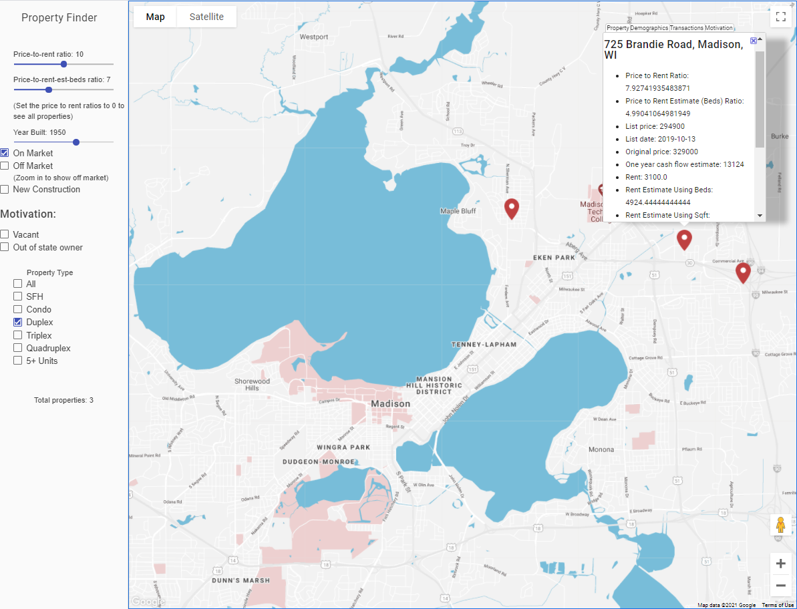

# OfferHawk

Executive summary
--------

When hunting for deals, small-scale residential real estate investors are often presented with a bombardment of irrelevant listings or only a small selection of listings, often selected from the vantage point of a biased buy side real estate agent. To sift through these listings, investors must juggle a variety of disparate data tools such as online listing sites, city portals, broker tools, and online calculators to perform tedious, manual comparative market analyses for underwriting. Moreover, current major online listing sites such as Zillow.com only allow users to filter by basic hedonic features such as the number of bedrooms, bathrooms, or square footage. Generally, these metrics do not offer investors a clear picture of the investment potential for a given property. **The goal of OfferHawk was to create a tool that would allow small-scale residential real estate investors to: 1) automatically synthesize relevant investment features across disparate data sources and 2) scalably compare a global set of on/off market single family rentals and 2-10 unit multifamily properties in a given market to enable data-driven investment theses.**

Codebase documentation
--------

- **‘data_generation/’**:
  - The high-level goal of the processes within this directory is to generate a series of “filters'' which are pickled dataframes containing a ranking of all on-market properties across each of the nine counties in the Madison, WI metro area by their price-to-rent ratio. These files are saved to the ‘/staged_data/’ subdirectory, and an example un-pickled csv file is included in the ‘/results/’ subdirectory.
  - Users can generate the set of filters by using the command line to run the ```data_retriever.py``` script through ```python data_retriever.py```. This script calls a series of helper scripts:
    - ```hsdata.py``` which scrapes and pulls raw MLS listing data from Homesnap.com. The raw scraped Homesnap data is saved to the subdirectory ‘/listing_data/’.
    - ```zillowdata.py``` which scrapes and pulls raw rental listing data from Zillow.com. The raw scraped Zillow data is saved to the subdirectory ‘/zillow_data/’, and metadata associated with the scrape is saved to the subdirectory ‘/metadata_zillow/’.
    - ```filterf.py``` which combines the listing data, zillow data, and census data to populate a dataframe of on-market properties with the following features:
      - Property characteristic data: number of units, current list price, current unit rents, sqft, number of beds/baths
      - Custom analytics: market rent estimates using the six closest Zillow rental listings: i. based on sqft, ii. based on the number of beds
      - Financial projection data: annual mortgage payment, down payment plus closing costs, 1-year cash flow
      - Demographic data: 1-year population growth, 3-year population growth, 5-year population growth, unemployment-%, family-%, college-%, poverty-%, vacancy rate, median age at census tract resolution pulled down from the census ACS API. 
      - Ranking: all properties in the dataframe are then ranked and compared according to their current market price-to-rent ratio.
  - Users can also use the ```emailer.py``` script to set up an automatic emailer for automatically generating and emailing a daily scrape of the filter.
  - The ```stage_data_final.py``` script is run to load the final dataframe as well as additional static datasets into the PostgreSQL database to be used by the companion Django web app. 
- **‘web_app/’**:
  - The high-level goal of the processes within this directory is to generate a Django web app with a PostgreSQL database backend hosted on the Google Cloud Platform: https://offerhawk-304318.uc.r.appspot.com/ 
    - Notes:
      - The OfferHawk web app makes use of the [“Property Finder”](https://github.com/googlemaps/property-finder)  project which presents a turnkey solution for a fictitious real estate business by constructing a baseline web app architecture with geospatial support.
      - The web app was discontinued after Dec-19, so on-market listing data displayed is current as of 11/23/19.
      - Underlying static web app data are not included in project delivery considering file size constraints; however, they can be viewed directly in the web app. The corresponding files in the codebase include:
        - All web-app properties: ‘data_generation/staged_data_DB/properties/*.pkl’
        - Property transaction history: ‘data_generation/assessor_data/ownership_sale.csv’
        - Permit data for new residential construction: ‘data_generation/construction/new_recent_builds_madison_jun_thru_aug_2019.csv’
        - Absentee owner status: ‘data_generation/vacancy_absentee/madison_vacant_properties_nov_2019_red2_mail.csv’
        - Property vacancy status: ‘data_generation/vacancy_absentee/madison_absentee_owner_properties_nov_2019_red_mail.csv’
  - The web app supports the map-based cross filtering of all on-market single family homes and 2-10 unit multifamily properties in Madison, WI scraped from Homesnap.com using the following filters:
    - Price-to-rent ratio which filters by each property’s listed price to its listed annual rental rate.
    - Price-to-rent-est-beds ratio which filters by each property’s listed price to its estimated annual rental rate using the six nearest zillow rental listings.
    - Year built which filters for all properties built during or after a given year.
    - On-market which filters for only on-market properties.
    - Off-market which filters for only off-market properties (upon zooming in).
    - New Construction which, if checked along with only off-market, filters for recently permitted residential new construction.
    - Vacant which filters for properties indicating property vacancy via USPS data, which could indicate increased seller motivation.
    - Out of state owner which filters for properties indicating the owner is living out of state, which could indicate increased seller motivation.
    - Property Type which filters for properties of a given property type from single family homes, condos, duplexes, triplexes, quadruplexes, and 5+ units.

<p align="center"><br><br><br></p>

  - For all on-market properties, four tabs of data are displayed in the popup:
    - Property which contains property-level hedonic features (beds, baths, sqft) as well as automated 1-year cash flow underwriting assuming:
      - A property tax value percentage of 2.4%
      - A mortgage financing down payment of 20% and commercial interest rate of 5% with $4000 in closing costs
      - $1000 in annual maintenance and $800 in annual insurance operating expenses
    - Demographics which contains demographic features pulled from the census ACS API for a property’s census tract.
    - Transactions which contains a record of a property’s transactional history in its previous ownership and purchase prices.
    - Motivation which contains two features indicating potential seller motivation: 1) if the property is currently vacant and 2) if the property owner lives out of state (absentee owner).
  - The web app is integrated with several Google APIs, such as Google Street View and Google Places, which give the investor access to both a virtual tour of the property and its surroundings as well as its hyperlocal features. 
  - Finally, if one checks the “Off Market” filter and zooms into the map, all off-market properties are shown with basic property features and transactional history.
  - **An example use case of the filter can be seen in Figure 1 whereby an investor can compare the current rental rate of a property to its estimated true market rental rate comparing its six nearest Zillow rental comparables to quickly identify market rent mis-pricings. In this case, the duplex at 725 Brandie Road on the East-side of Madison, WI operates with a gross monthly rental income of $3100, but the estimated rent using the number of beds is ~$5000, much higher.**
- There are three notable areas of improvement for future project versions:
  - The data scraping, filter, and web app were fundamentally created to service the personal/custom automated due diligence for a single investor, so if the setup were to be used by external users, a level of polish would need to be added to the UI/front-end, e.g. rounding feature values in popup boxes.
  - The market rent estimation could be model based using either linear regression for ease of feature interpretability or non-linear machine learning models to accurately model the complex functional relationship between a property’s hedonic/hyperlocal features and its attainable market rent. 
  - Scaling the project to other markets would require dynamic adjustments to the underwriting assumptions, e.g. expected property tax or maintenance operating expenses.


